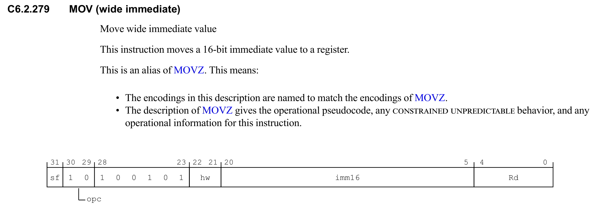

## start.S 启动代码
> start.S是cpu上电运行的第一段代码,负责初始化硬件环境并且为程序运行做准备。
#### 设置栈指针
c语言的函数调用栈来保存返回地址、局部变量和函数参数，进入c代码之前必须为栈指针（sp）设置一个有效值。栈从高地址向低地址生长，所以栈指针初始化为RAM的高地址边界。

#### 清空 BSS 段
BSS用于存储为初始化的全局和局部变量，如果不手动将BSS段清零，上电后的RAM内容会是不确定的随机值。
#### BSS 段的优化意义 
- **减小二进制文件大小**：未初始化的变量不占用文件空间 
- **加快加载速度**：只需记录大小，运行时清零 
- **统一初始化**：保证所有未初始化变量的初始值为零
#### BSS段清零不能用`memset`
`memset`是c库函数，其实现本身可能使用为初始化的全局变量，或需要已经初始化的栈，BSS清零前调用`memset`会导致循环依赖。

#### 跳转到 main 
底层硬件初始化完成后将控制权交给c程序入口点`main`。

## 写代码

#### 链接脚本

链接脚本用于告诉连接器代码和数据放在内寸的哪个位置。

下面是最简单的链接脚本：
```
ENTRY(_start)                   //ENTRY指定入口符号，也就是告诉链接脚本从哪里开始
SECTIONS{
    . = 0x40000000;
    
    .text : {
        src/start.o(.text)
        *(.text)
    }

    . = ALIGN(16);                //ARM64要求栈指针必须16字节对齐，在定义栈或者数据段之前要对齐八字节。
    _stack_top = . + 0x10000;
}
/*
‘.’ 是位置计数器，. = `0x40000000` 意思是从 0x40000000 开始放东西。
 */
```

#### start.S
```
.global _start
_start:
	ldr x0, =_stack_top   
	mov sp, x0
	bl main
/*
传递栈顶地址给sp
 */
```

#### 为什么不能直接写`mov x0, _stack_top`?
>查阅数据手册可以知道，MOV指令立即数最大就是16位，无法通过一次指令表示`0x40010000`这种任意地址

