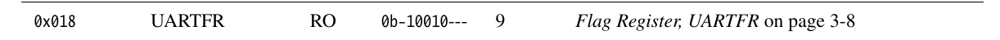
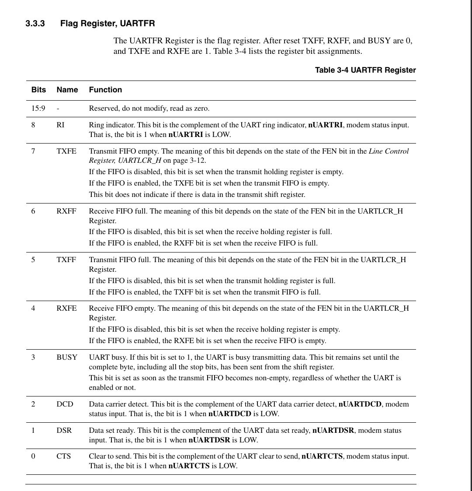

## 阅读手册
我们需要打印helloworld，需要知道两个事：
>1.字符往哪里写       
>2.什么时候可以写

为此我们需要找到`DR`和`FR`

| 寄存器               | 作用    | 为什么需要      |
| ----------------- | ----- | ---------- |
| DR(Data Register) | 数据寄存器 | 写入的字符从DR发出 |
| FR(Flag Register) | 状态寄存器 | 得知缓冲区是否满了  |


**DR寄存器的偏移量为0x000**



**FR寄存器的偏移量为0x018**

接下来查找TXFF的位定位。

**TXFF**是bit5

知道了寄存器偏移量和位定位后开始写uart.h
```
#ifndef __UART_H__

#define __UART_H__

  

#define UART_BASE 0x09000000

#define UART_DR (UART_BASE + 0x000)

#define UART_FR (UART_BASE + 0x018)

  

#define UART_TXFF (1<<5)

  

#endif
```

## uart.c实现

```
void uart_putc(char c)
{
	while(UART_FR & UART_TXFF); //判断缓冲区是否为满

	UART_DR = c;
}

void uart_puts(char *s)
{
	while (*s){
		uart_putc(*s++);
	}
}
```
