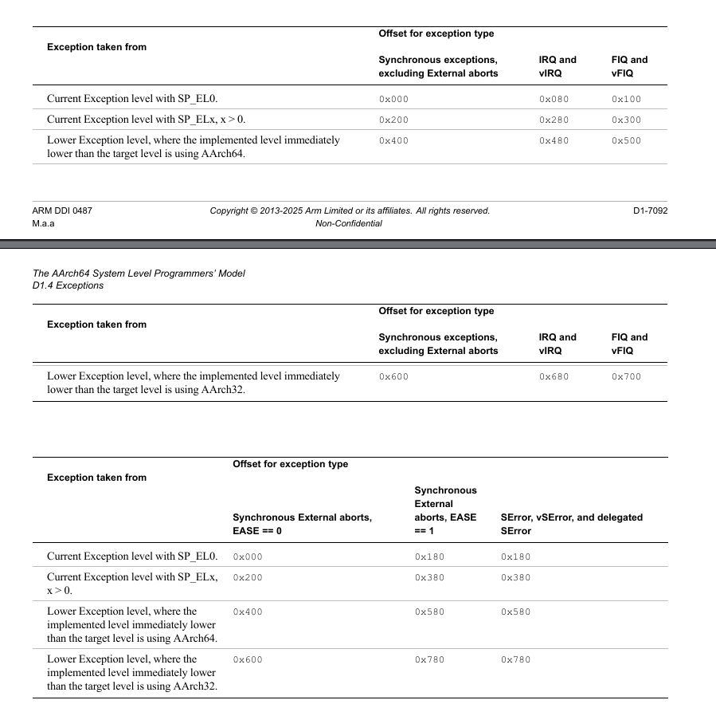

>虽然现在能够跑helloworld，但如果遇到错误（比如访问非法地址），CPU会挂死且没有提示，异常向量表可以让我们获取错误信息。

## 阅读手册
找到手册《DDI0487_M_a_a_a-profile_architecture_reference_manual》

### 什么是异常
在CPU运行的时候，遇到被打断的事件就称作异常，这是一个技术术语，并不带贬义。CPU被打断后需要知道要跳去那哪里处理，向量表就是告诉cpu跳转去哪里的一张表。

### 异常类型
ARM64有**4**种异常类型：
>**Synchronous**:代码主动触发，如执行非法指令，访问非法地址，调用`svc`系统调用。叫作**同步**是因为和正在执行的指令相关。

>**IRQ**:外部硬件中断，如定时器中断，串口中断。

>**FIQ**:快速中断，比IRQ优先级更高。

>**SError**系统错误，比如外部内存总线出错。

每个异常发生的时候，都需要区分**状态**，ARM64按照两个维度区分：
>1,异常来自当前EL还是更低的EL
>2.异常发生的时候用的哪个栈指针

<details>
<summary> 什么是EL</summary>

EL=Exception Level(异常级别)
ARM64把CPU运行权限分成4层，数字越大权限越高：

<ul> 
<li><strong>EL0</strong> — 用户程序（权限最低，不能碰硬件）</li> 
<li><strong>EL1</strong> — OS 内核（管理内存、中断）</li>
<li><strong>EL2</strong> — Hypervisor（虚拟机监控器 ← 最终目标）</li>
<li><strong>EL3</strong> — 安全固件（Secure Monitor，一般不碰）</li> 
</ul>

EL0 的用户程序不能直接操作硬件，必须通过 EL1 内核。EL1 的内核不能绕过 EL2 的 Hypervisor。每一层只能访问自己和更低层的资源。

</details>

这两个维度可以组合出四组情况，一共有四个入口，所以4组 * 4入口= 16入口，异常向量表有16个入口。

**vector.S**
```
/*
----------------------------
第1组：当前EL,SP_EL0
----------------------------
*/
.balign 128 //0X00 - Synchronous
b .

.balign 128 //0x080 - IRQ
b .

.balign 128 //0x100 - FIQ
b .

.balign 128 //0x180 - Serror
b .

/*
----------------------------
第2组：当前EL,SP_ELx
----------------------------
*/
.balign 128 //0x200 - Synchronous
b .

.balign 128 //0x280 - IRQ
b .
 
.balign 128 //0x300 - FIQ
b .

.balign 128 //0x380 - Serror
b .

/*
----------------------------
第2组：更低级EL，AArch64
----------------------------
*/
.balign 128 //0x400 - Synchronous
b . 

.balign 128 //0x480 - IRQ
b .
  
.balign 128 //0x500 - FIQ
b .  

.balign 128 //0x580 - Serror
b . 

/*
----------------------------
第4组：更低级EL,AArch32
----------------------------
*/
.balign 128 //0x600 - Synchronous
b . 

.balign 128 //0x680 - IRQ
b .
  
.balign 128 //0x700 - FIQ
b .
  
.balign 128 //0x780 - Serror
b .
```
**start.S**
```
.global _start
_start:
ldr x0, =_stack_top
mov sp, x0

ldr x0, =vector_table
msr vbar_el1, x0

bl main
```

