> **📋 一些基础概念**
> 
> - **Stage 1**:将**虚拟地址 (VA)** 转换为**物理地址 (PA)**（在非虚拟化环境下）或者转换为**中间物理地址 (IPA)**（在虚拟化环境下）。它主要受 OS 控制，用来做进程隔离。
> 
> - **Stage 2**：将 **IPA** 转换为真正的 **物理地址 (PA)**。
### 为什么需要**MMU**？
裸机代码中CPU发送的地址直接发送到物理内存。但存在几个问题：
- 所有代码都能访问所有地址，没有保护
- 若跑多个Guest OS,地址会存在冲突
- 没法控制某段内存是 cacheable 还是 device 类型

MMU就是在CPU和物理内存中充当了翻译：CPU发送虚拟地址（VA），MMU通过查表翻译成物理地址（PA），同时附带权限和属性的信息。MMU查的这个表就是**页表**。

#### **恒等映射**：
>恒等映射即虚拟地址=物理地址

先从恒等映射开始是因为：
>从 BootLoader/BIOS 跳转到操作系统(如 Linux 内核)入口时,MMU 是关闭的。关闭了MMU 意味着不能利用高速缓存的性能。
>**MMU 关闭**: 所有内存访问都是 Non-cacheable,每次访问主存 ~100+ cycles。
>**MMU 开启**: 页表标记内存为 Cacheable,Cache 命中 ~3-5 cycles。
>因此,我们在初始化的某个阶段需要把 MMU 打开并且使能数据高速缓存,以获得更高的性能。

***但是MMU开启的瞬间，CPU发送的所有指令都会被翻译。如果VA≠PA，PC指向的地址会指向错误位置。这时候恒等映射就派上用场了，确保开启前后代码能正常运行***
#### 页表
假设有一个`uint64_t table[512]`,通过index，数组返回一个值。页表原理类似，MMU拿到一个虚拟地址，从里面找到几个bit当作index，从页表去查数组，得到结果。如果一级数组来覆盖整个48-bit地址空间，需要2^48，不现实。

所以需要用到**多级数组**。4KB garanule是一个四维数组查找：
- table_L0[i0] -> 指向table_L1
- table_L1[i1] -> 指向table_L2
- table_L2[i2] -> 指向table_L3
- table_L3[i3] -> 最终的物理页地址



**1. 基础限制**
* **页大小 (Page Size):** 4KB ($2^{12}$ Bytes)。
* **指针大小:** ARM64 是 64 位系统，每个页表项 (PTE) 需 8 Bytes ($64 \text{ bits}$)。

**2. 单级页表容量计算**
由于一页只有 4KB，所以一张页表能容纳的条目数为：
$$\frac{4096 \text{ Bytes}}{8 \text{ Bytes}} = 512 \text{ Entries} = 2^9$$
这意味着，每一级索引需要 **9 bits** ($2^9=512$)。

**3. 地址位宽推导 (4级页表)**
$$\underbrace{9}_{\text{L0}} + \underbrace{9}_{\text{L1}} + \underbrace{9}_{\text{L2}} + \underbrace{9}_{\text{L3}} + \underbrace{12}_{\text{Offset}} = \mathbf{48 \text{ bits}}$$

**4. 为什么不是 3 级？**
* **3级页表:** $9+9+9+12 = 39 \text{ bits}$。寻址范围 $2^{39} = 512 \text{ GB}$ （明显不够用）。
* **4级页表:** $48 \text{ bits}$。寻址范围 $2^{48} = 256 \text{ TB}$ 。



### 实现1GB Block mapping
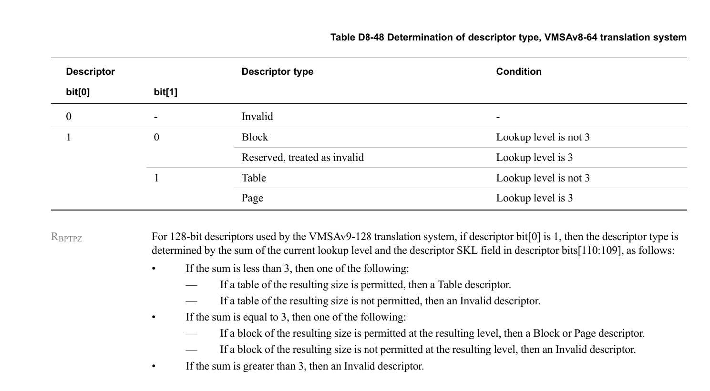
这个是看最低的两位：
- 当bit[0]等于0的时候，Descriptor是Invalid。
- 当bit[0]为1的时候，bit[1]为0则blcok（除了lv3），bit[1]为1的话就指向Table(下一级页表)。由于我们暂时先实现1GB的，暂时不用管lv3.![](images/bit_field.png

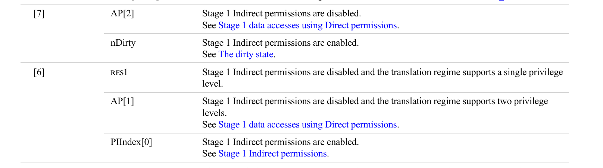
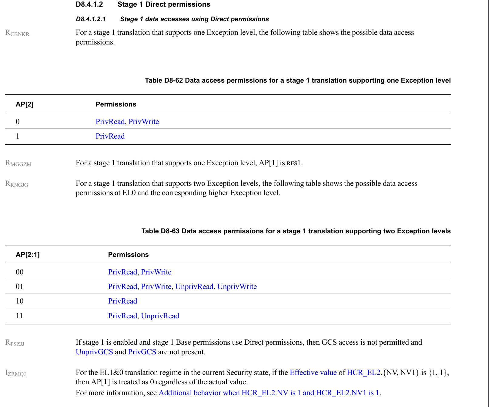
我们目前在跑EL1，没有用户态程序，选 **AP = 00**（PrivRead, PrivWrite）。
#### **AF**:
AF即Acess flag。

**AF 位用于告诉软件或硬件：这个页面最近是否被访问过。**

`AF = 0`的时候表示页面尚未访问。`AF = 1`表示页面已经被访问。

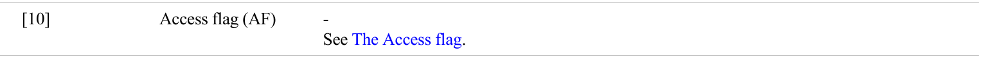

AF的比特位是[10]。
#### **SH**：
**SH 用来告诉硬件一块内存的数据，需要和谁保持一致。**

###### *Stage 1 Shareability attributes：*

| SH[1:0] | 普通内存            | 补充说明                                                                  |
| ------- | --------------- | --------------------------------------------------------------------- |
| 00      | Non-shareable   | **不共享**。这块内存被视为只有当前 CPU 核在使用。硬件**不会**去窥探其他核的 Cache，其他核也看不到你的 Cache。   |
| 01      | Reserved        |                                                                       |
| 10      | Outer Shareable | **外部共享**。通常指数据需要在 CPU 簇（Cluster）之外也保持一致（例如与 GPU、DMA 等外设共享，取决于系统互联架构）。 |
| 11      | Inner Shareable | **内部共享**。**这是 SMP 系统的标准配置**。表示所有运行同一个 OS/Hypervisor 的 CPU 核都能看到一致的数据。 |

SH的比特位是[9:8]。

### **AttrIndx**:
**AttrIndx 是一个查表索引**

MAIR_EL1 里有 8 个槽位（Attr0~Attr7），每个槽位定义一种内存类型。descriptor 里的 AttrIndx 告诉 CPU："去第 N 个槽位查这块内存该怎么对待。"

我们目前需要定义两个槽位，一个给 Device，一个给 Normal memory。然后不同的 block descriptor 用不同的 AttrIndx 值指过去。


我们目前是4KB granule + Level 1 Block descriptor，所以只看这行：

> **Block[47:17]** → **OAB[47:30]** → 4KB granule, level 1 Block descriptor. Descriptor bits [29:17] are RES0.

> [!NOTE] 
> 由于 Hypervisor（EL2）通常只运行它自己，不涉及“子用户态”（除非开启了特定的虚拟化特性），所以 **AP[1] 在这里被忽略了**，只剩 `AP[2]` 起作用。
> For a stage 1 translation that supports one Exception level, AP[1] is RES1.


**AP**使用两个bit（Bits7:6）.对应了四种权限状态：

| AP[2:1] | EL1权限      | EL0权限      |
| ------- | ---------- | ---------- |
| 00      | READ/WRITE | None       |
| 01      | READ/WRITE | READ/WRITE |
| 10      | READ       | None       |
| 11      | READ       | READ       |
**可以看出，AP[2]对应EL1权限，AP[1]对应EL0权限。**

现阶段我们的EL1权限给READ/WRITE。

#### **MAIR_EL1**：
MAIR_EL1 是 64 位寄存器，分成 8 个 8-bit 槽位（Attr0 ~ Attr7）。
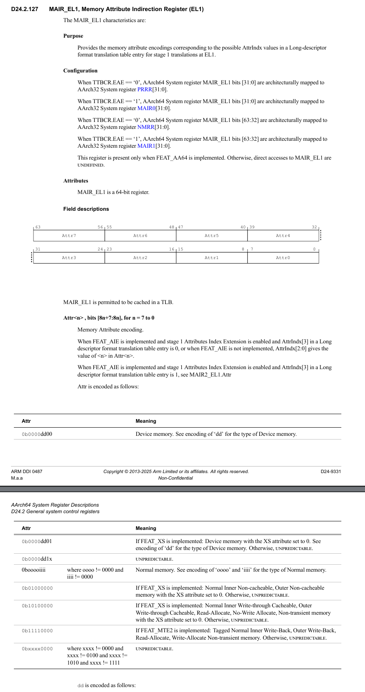
> 0b0000dd00 Device memory. See encoding of ‘dd’ for the type of Device memory

device memory,dd决定子类型。

##### **oooo**
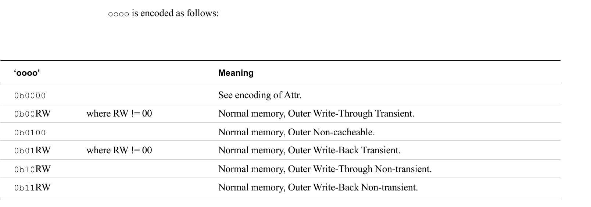
**高2位**决定的是memory的cache策略类型，**低2位**决定的是allocate策略。

我们需要`Write-Back Non-transient, Read-Allocate, Write-Allocate`
- 高2位 = 0b11 (Normal memory, Outer Write-Back Non-transient.)
- R = 1, W = 1 （*R/W miss时分配cache line*）
##### **iiii**
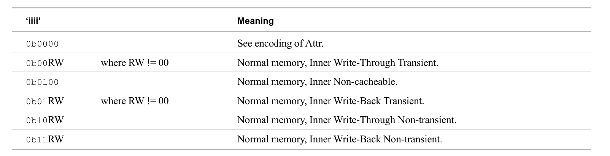
**高2位**决定的是memory的cache策略类型，**低2位**决定的是allocate策略。

我们需要`Write-Back Non-transient, Read-Allocate, Write-Allocate`
- 高2位 = 0b11 (*Normal memory, Inner Write-Back Non-transient*)
- R = 1, W = 1 （*R/W miss时分配cache line*）
- 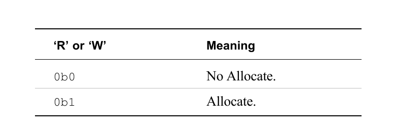

****

0xooooiiii = `0b1111_1111` = `0xFF`

####  **TCR_EL1:**
>The control register for stage 1 of the EL1&0 translation regime.
>用于 EL1 和 EL0 地址转换机制中，第一阶段（Stage 1）转换的控制寄存器。


****

##### **TOSZ**:
TTBR0_EL1所引用的内存区域的大小偏移量。该区域大小为2(64-T0SZ)字节。

我们需要48-bit的虚拟地址空间,也就是说我们的`TCR_EL1.T0SZ`为16。

##### **TG0**:
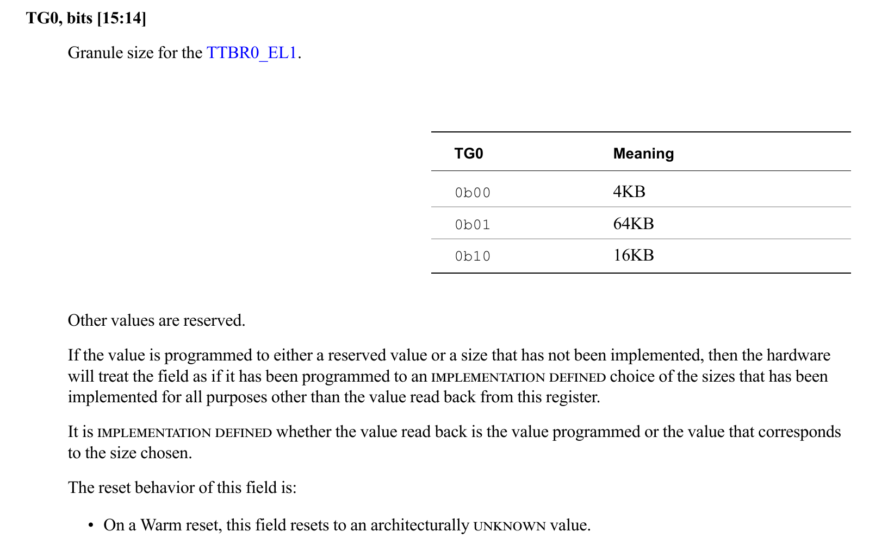
我们是4KB，TG0为0b00。

##### **SH0:**
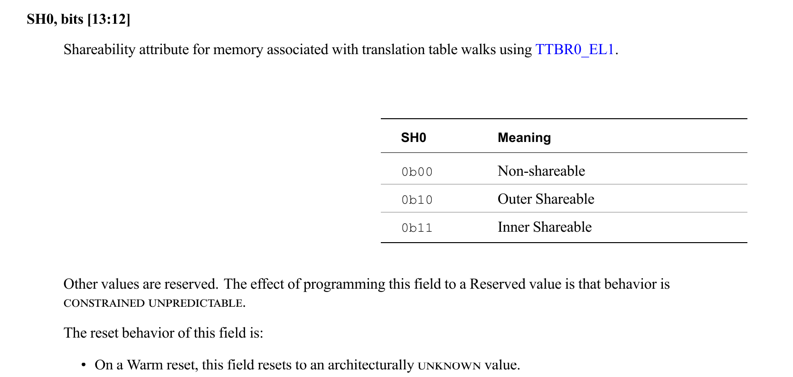
多核场景用`Inner Shareable`,0b11。

##### **ORGN0/IRGN0:**
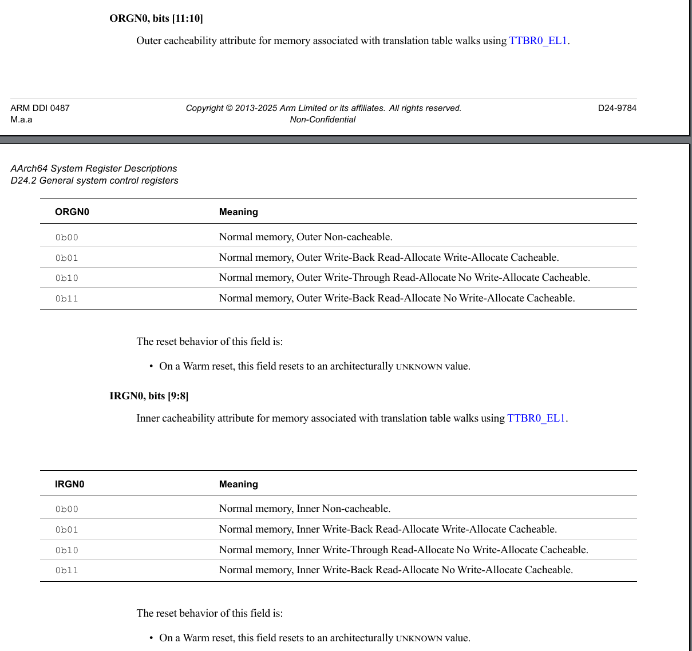
这两个字都是CPU做页表walk时访问页表内存采用的**cache策略**。
因为页表在普通RAM里，所以页表work应当是cachable的。

两者都选择`0b01`。

##### 总结TCR_EL1:
- TG0 = 0b00 [15:14]
- SH0 = 0b11 [13:12]
- ORGN0 = 0b01 [11:10]
- IRGN0 = 0b01 [9:8]
- TOSZ = 16 [5:0]
###  开启MMU步骤
1.**配置MAIR_EL1** ：定义内存属性槽位
2.**配置TCR_EL1**：高速CPU页表格式，如granule、地址宽度
3.**写入TTBR0_EL1**:把Level 0页表的物理地址告诉CPU
4.`SCTLR_EL1.M=1`：开启MMU

**mmu.h**
```C
#ifndef __MMU_H__
#define __MMU_H__

/* MAIR_EL1 */
#define MAIR_DEVICE_nGnRnE (0x00 << 0)
#define MAIR_NORMAL_WB     (0xFF << 8)

#define MAIR_EL1_VALUE    (MAIR_NORMAL_WB | \
                            MAIR_DEVICE_nGnRnE)

/* TCR_EL1 */                            
#define TCR_T0SZ           (16UL << 0)
#define TCR_IRGN0          (0x01UL << 8)
#define TCR_ORGN0          (0x01UL << 10)
#define TCR_SH0            (0x03UL << 12)
#define TCR_TG0            (0x00UL << 14)


#define TCR_EL1_VALUE (TCR_T0SZ  | \
                      TCR_IRGN0  | \
                      TCR_ORGN0  | \
                      TCR_SH0 | \
                      TCR_TG0)

/* descriptor */
#define DESC_AP                 (0x00UL << 6)
#define DESC_AF                 (0X01UL << 10)     
#define DESC_SH_INNER           (0X03UL << 8)
#define DESC_SH_OUTER           (0X02UL << 8)
#define DESC_ATTRINDX_DEVICE    (0x00UL << 2)  
#define DESC_ATTRINDX_NORMAL    (0x01UL << 2)  
#define DESC_BLOCK              (0x01UL) 
#define DESC_TABLE              (0x03UL) 
                        
#endif
```

**mmu.c**
```c
#include "mmu.h"

__attribute__((aligned(4096))) uint64_t l0_table[512];
__attribute__((aligned(4096))) uint64_t l1_table[512];

void mmu_init(void)
{
    // L1[0]: 0x00000000 ~ 0x3FFFFFFF, Device
    l1_table[0] = 0x00000000UL | DESC_AF | DESC_SH_OUTER | DESC_ATTRINDX_DEVICE | DESC_BLOCK;

    // L1[0]: 0x40000000 ~ 0x7FFFFFFF, Normal
    l1_table[1] = 0x40000000UL | DESC_AF | DESC_SH_INNER | DESC_ATTRINDX_NORMAL | DESC_BLOCK;

    // L0[0]: table descriptor, point to next level table(L1)
    l0_table[0] = (uint64_t)l1_table | DESC_TABLE;
}
```