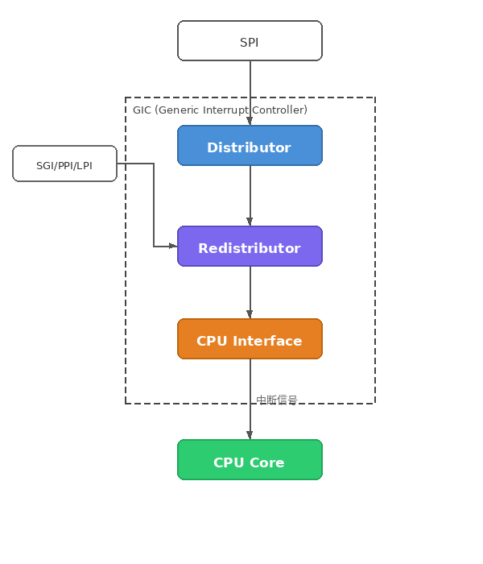

#### 什么是GIC
GIC(Generic Interrupt Controller)即通用中断控制器。

GIC负责接受来自外设或者软件的中断信号，进行优先级排序，将其分发给处理器核心（PE）。

GIC使用中断ID来判断中断源：
- SGI:ID 0-15。软件生成的中断，通常用于核间通信（IPI）。
- PPI:ID 16-31。私有外设中断，特定用于某个核心。
- SPI:ID 32-1019。共享外设中断，可以路由给任意核心和一组核心。
- LPI:ID 8192及以上。**GICv3**新增的，基于消息的中断，主要用于PCLe

中断在其生命周期中会处于以下几种状态 ：
- **Inactive (非活动)**: 中断未发生。
- **Pending (挂起)**: 中断已发生，等待核心处理。
- **Active (活动)**: 核心已确认中断，正在处理中。
- **Active and Pending**: 核心正在处理该中断，但同源的新中断又发生了。
- _注意：LPI 没有 Active 状态，只有 Pending 或 Inactive。_
### 从外设到CPU的流水线
GICv3中，三个组件构成了中断从生产到被CPU处理的流水线：
- **Distributor(全局分发器)**:根据 `GICD_IROUTERn` 寄存器配置的亲和性，将 SPI 路由到特定的目标 PE。在多个挂起的 SPI 中，选出优先级最高的 SPI，并将其挂起状态转发给对应的 Redistributor。
- **Redistributor（本地重分发器）**：**第二级（聚合）仲裁**，接收来自 Distributor 的最高优先级 SPI，将其与本地挂起的最高优先级 PPI、SGI 和 LPI 进行综合比较，选出该 PE 视角下的**绝对最高优先级中断**，并将其发往 CPU Interface。
- **CPU Interface (CPU 接口)**：GIC 与 PE 核心内部流水线交互的直接物理/逻辑接口。

### 阅读*IHI0069H_b_gic_architecture_specification*
#### Distributor
##### **GICD_CTRL**:
GICD_CTRL是Distributor的**控制寄存器**。